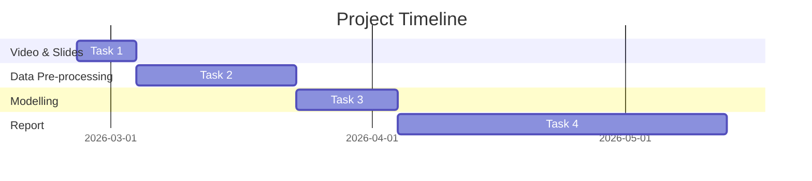

# UoM DATA70202 Group25  
**Topic: Time-serials Modelling on Eggs Prices in Peru**  
Industry Partner: [La Calera SAC](https://www.lacalera.pe/)  
Project Description: [View on UoM Sharepoint](https://livemanchesterac-my.sharepoint.com/:w:/r/personal/yuhang_xie-3_postgrad_manchester_ac_uk/_layouts/15/doc2.aspx?sourcedoc=%7B7DFA38D0-850F-434C-AD4E-BDFD996C9306%7D&file=P25%20La%20Calera%20SAC.docx&action=default&mobileredirect=true&DefaultItemOpen=1&web=1)

# Project Design  
## Tasks Allocation and Timeline  
| Part   | Deadline | Status | In Charge |
| :--------: | :-------:  | :-------: | :-------: |
| Video and Slides |   4th March   | ongoing | [Ishita](mailto:ishita.satija@postgrad.manchester.ac.uk) |
| Data Pre-processing |   23rd March   |  ongoing  | - |
| Modelling |  4th April   |  ongoing  | [Harry](mailto:yuhang.xie-3@postgrad.manchester.ac.uk) |
| Report |   13th May   |  ongoing  | [James](mailto:james.askew-3@postgrad.manchester.ac.uk) |

## Project Timeline

## Task 1
### Task 1 Deadline
1. 4th March, deliver to [Ishita](mailto:ishita.satija@postgrad.manchester.ac.uk)
2. 6th March, submission

### Vedio and Slides
| Part | Member | Video Length (up to) | Slide Pages (up to) |
| :--------: | :-------:  | :-------: | :-------: |
| Introduction | [Yulia](mailto:hanxi.yu@postgrad.manchester.ac.uk) | 30 secs | 1 |
| Background | [Ishita](mailto:ishita.satija@postgrad.manchester.ac.uk) | 30 secs | 1 |
| Datasets | [Kiko](mailto:yi.gao-5@postgrad.manchester.ac.uk) | 1 min | 2 |
| Methods | [James](mailto:james.askew-3@postgrad.manchester.ac.uk) | 1 min | 2 |
| Models | [Harry](mailto:yuhang.xie-3@postgrad.manchester.ac.uk) | 1 min | 2 |
| Timeline | [Jaden](mailto:jiajun.tian@postgrad.manchester.ac.uk) | 30 secs | 1 |

*Limitations: Vedio up to 5 mins, Slides up to 10 slides.*  
**Please finish recording your part before 4th March and send to [Ishita](mailto:ishita.satija@postgrad.manchester.ac.uk).**

## Task 2
### Task 2 Deadline
1. 23rd March (has been done)
2. 4th May (report ddl)

### Data Pre-processing  
This part is handled by [Yulia](mailto:hanxi.yu@postgrad.manchester.ac.uk)  
She has uploaded the integrated data to [integrated data](https://github.com/gggaiii/UoM_DATA70202_Group25/blob/main/Data%20Preprocessing.ipynb)  
Please have a check and if needed, use this dataset for further analysis.  

### EDA
This part is handled by [James](mailto:james.askew-3@postgrad.manchester.ac.uk)  
Please can everyone send the EDA expecially the visualisation works to him via Teams or email.  

## Task 3
### Task 3 Deadline
1. 4th April (estimated for finishing modelling but could take longer)
2. 4th May (report delivery)

### Modelling
1. Prophet is applied, see on [Geo Analysis and Prophet](https://github.com/gggaiii/UoM_DATA70202_Group25/blob/main/Geo_EDA_and_Prophet_Model.ipynb)
2. ARIMA will be modelled by [Ishita](mailto:ishita.satija@postgrad.manchester.ac.uk)
3. LSTM will be modelled by [Harry](mailto:yuhang.xie-3@postgrad.manchester.ac.uk)  

## Task 4
### Task 4 Deadline
1. 4th May, deliver to [James](mailto:james.askew-3@postgrad.manchester.ac.uk)
2. 13th May, submission

### Report
Task Division
|  Part  |  Contributor  |
| :--------: | :-------:  |
|1. Introduction |  Kiko  |
|2. Market Insight |  Kiko and Jaden  |
|3. Data Pre-processing | Yulia |
|4. EDA  |  James  |
|5. Methods |  Harry and Ishita  |
|5.1 Literature Review  |  Jaden  |
|6. Modelling |  Harry and Ishita  |
|7. Result and Analysis |  TBA  |
|8. Conclusion |  TBA  |

*To Kiko, please write an introduction to this project*
*To Kiko and Jaden, please do some basic research on the egg market in Peru*
*To Jaden, Please do some literature review on `Prophet`, `ARIMA` and `LSTM`*
*To all, please remark the reference you use when writing the report*
**Please finish recording your part before 4th May and send to [James](mailto:james.askew-3@postgrad.manchester.ac.uk), but it would be better if you could finish before the easter break**

